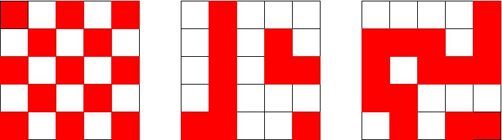

This code attempts to solve a bonus question in a math set; it ultimately reaches a count of **4925281 valid grids**. The problem is given as:

"Consider a 5×5 grid where each cell is either filled or empty, and all configurations are equally likely.

Using a computer to count, find the probability that there is a path (going left or right; and up or down, but not diagonally) from the bottom of the grid to the top only going through filled cells. As an example, in the figure below, there is a path in the second and third examples, but not in the first."

  

My code represents grids as binary values, first evaluating them with a speedy 'quickcheck' before switching to a more thorough 'deepcheck' as required. The 'quickcheck' looks for straight lines; a completely vertical line is a confirmed match, while an empty horizontal line is a non-match. On the other hand, 'deepcheck' uses a modified version of depth-first search to evaluate more complex paths which may bend or branch. Essentially, 'deepcheck' uses a stack, prioritizing larger values and working towards the top row; however, the 'grid' is represented as a 1D list of cells, and boundary checks are required to respect the row structure for example.

To get the probability the problem asks for, place this value over the problem universe, or 2^25. This gives approximately 0.1468 as the answer.
